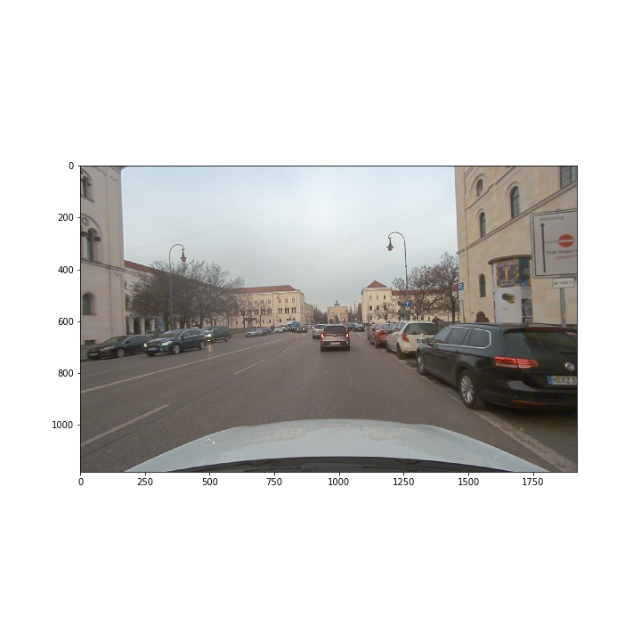
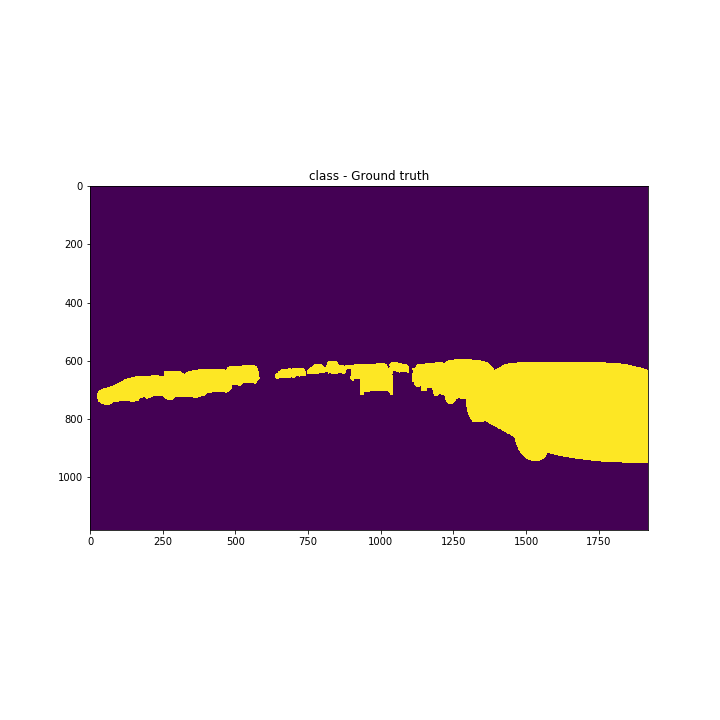
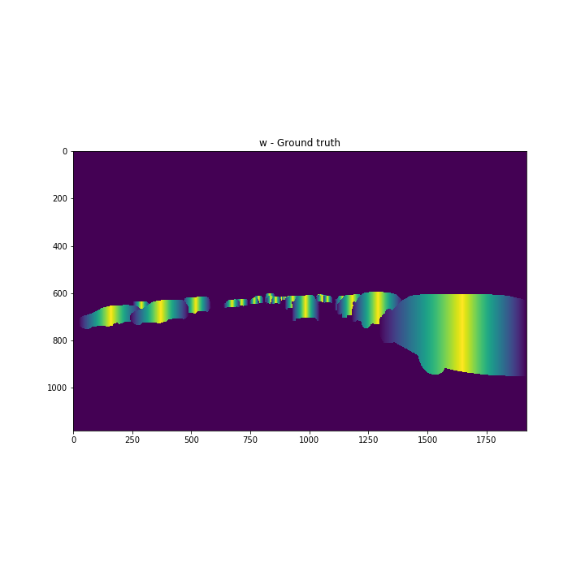
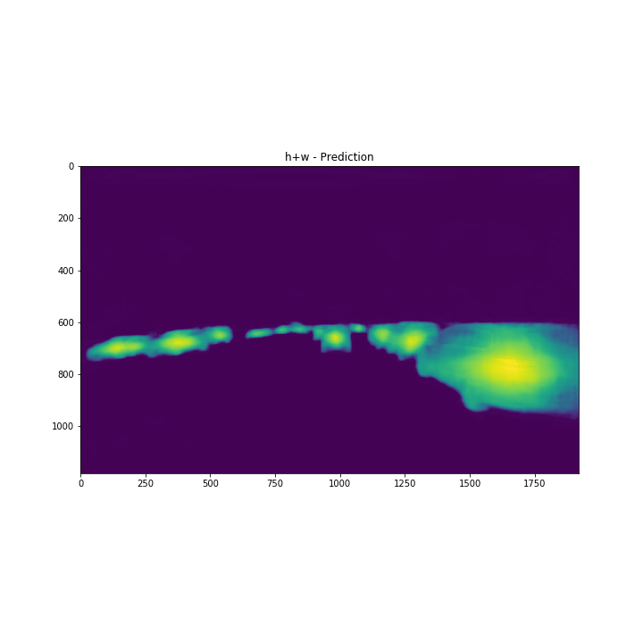

**:exclamation:This is work in progress. The functionality is far from complete:exclamation:**

# instance_segementation
This is a quick demo of instance segmentation and recovery of bounding boxes from the instance predictions

## Formulation

So far, the formulation is quite simple.
I used Unet with Resnet134.

for an input with shape `(batched, height, width, 3)` the output shape is `(batchen, height, width, numclasses+2)`.
So, the first `numclasses` output channels define the class prediction per pixel. Note that background is also a class.

### Currently
The first of the last two components is the absolute distance to the left-most or right-most pixel of that instance (whichever one is smaller).
The second of the last two components is the absolute distance to the upper-most or lower-most pixel of that instance (whichever one is smaller).

For each instance, those vectors are additionally sclaled, such that the obejct center has always magnitude 1.0.

### Planned
The last 2 components are the x and y component of that pixel to the nearest object boundary.
For each instance, those vectors are additionally sclaled, such that the obejct center has always magnitude 1.0.

## Results so far

The following shows the results obtained so far.

**Please note that this is the very first training done so far. There was no Hyperparmeter tuning what so ever, let alone experiements with the model architecture.***

Here is the input image:

  

Here are class ground truth and prediction:

  
  

Here are x-vector-component ground truth and prediction:

  
  

Here are y-vector-component ground truth and prediction:

  
  

Here are the distance vector magnitudes for ground truth and prediction:

  
  

